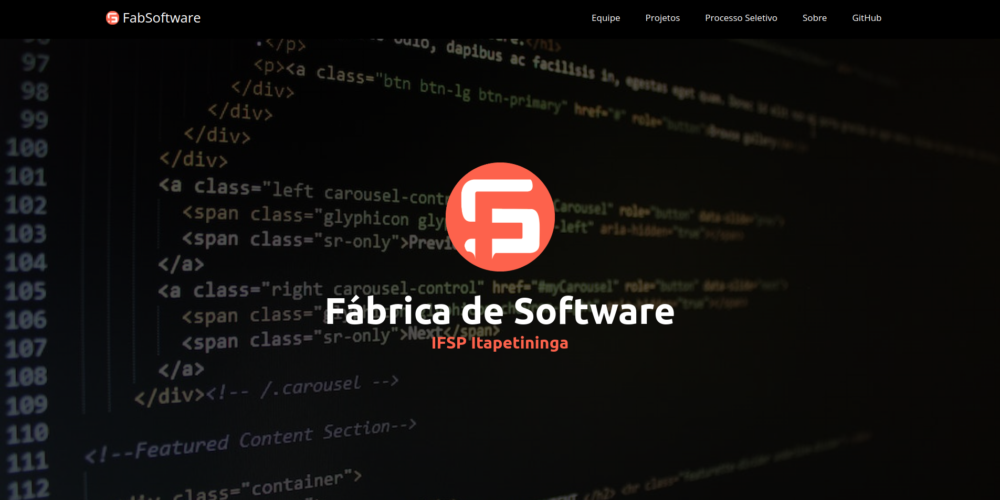

# Fábrca de Software

# Descrição do Projeto

O site da Fágrica de Software é um projeto que visa informar e divulgar as pessoas de fora da fábrica sobre o estado dela, divulgando os sites, apps e projetos feitos pelos integrantes da fábrica, possuindo diversas páginas para o site como: Página Incial, Páginas de Membros, Página de Projetos e diversas outras. Utilizando-se das tecnologias de GreenWoodJs, o site é construído com HTML, CSS, JavaScript e MarkDown.

# Status do Projeto
Status: Finalizado

# Funcionalidades e Demonstração da Aplicação
O projeto exibe diversas páginas, dentre elas, página de membros, página de projetos e sobre.

# Instruções de Uso
Para acessar o site da fábrica de software localmente, deve ser feito o clonamento deste repositório.

1. `git clone`

Após isso, executar no terminal, os comandos:

2. `npm install`
3. `npm start`

E basta acessar a hospedagem local.

# Acesso ao Projeto (Link do Projeto)
[Fábrica de Software](https://fabsoftware.itp.ifsp.edu.br/)

# Contribuição/Autores
| [ Danilo Camargo Bueno](https://avatars.githubusercontent.com/u/2002182?v=4)| [ Vitor Gabriel Cavalheiro](https://github.com/Vitor-G-Cavalheiro) | [ Gabriel Machado](https://github.com/gabs1m) |
| :---: | :---: |:---: |